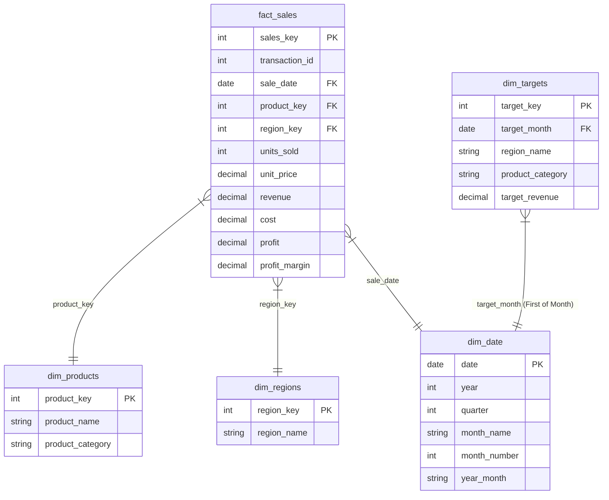

# Power BI Dashboard Blueprint: Sales & Revenue MIS System

This blueprint details the layout, data model relations, key DAX expressions, and visual designs to transform the SQL Star Schema database into an interactive Power BI Executive dashboard.

---

## 1. Data Model Diagram Recommendation (Star Schema)

For optimal query performance, DAX simplicity, and filtering integrity, we employ a classic **Star Schema** data model. The fact table lies at the center, surrounded by three dimension tables and one target bridging table.



### Relationship Cardinalities
1. **`fact_sales` (Many) ─── (One) `dim_products`**: Single direction filter (`dim_products` filters `fact_sales`). Relationship on `product_key`.
2. **`fact_sales` (Many) ─── (One) `dim_regions`**: Single direction filter (`dim_regions` filters `fact_sales`). Relationship on `region_key`.
3. **`fact_sales` (Many) ─── (One) `dim_date`**: Single direction filter (`dim_date` filters `fact_sales`). Relationship on `sale_date` (fact) to `date` (dim).
4. **`dim_targets` (Many) ─── (One) `dim_date`**: Single direction filter (`dim_date` filters `dim_targets`). Relationship on `target_month` (target) to `date` (dim).

---

## 2. Key DAX Formulas for Essential KPIs

Create a dedicated measure table called `_Measures` in Power BI to house these metrics.

### KPI 1: Year-to-Date (YTD) Revenue
Calculates cumulative revenue from the start of the current calendar year up to the selected date.
```dax
YTD Revenue = 
TOTALYTD(
    SUM(fact_sales[revenue]),
    dim_date[date]
)
```

### KPI 2: Month-over-Month (MoM) % Revenue Growth
Calculates the percentage change in revenue compared to the previous month.
```dax
MoM % Revenue Growth = 
VAR CurrentMonthRev = SUM(fact_sales[revenue])
VAR PrevMonthRev = 
    CALCULATE(
        SUM(fact_sales[revenue]),
        DATEADD(dim_date[date], -1, MONTH)
    )
RETURN
    DIVIDE(CurrentMonthRev - PrevMonthRev, PrevMonthRev, 0)
```
*Note: Format this measure as a Percentage (`0.0%`).*

### KPI 3: Target Achievement Rate
Measures actual sales performance as a percentage of the set target budget.
```dax
Target Achievement Rate = 
VAR ActualRevenue = SUM(fact_sales[revenue])
VAR TargetRevenue = SUM(dim_targets[target_revenue])
RETURN
    DIVIDE(ActualRevenue, TargetRevenue, 0)
```
*Note: Format this measure as a Percentage (`0.0%`). Apply conditional color formatting (e.g., Red if `< 90%`, Yellow if `90% - 100%`, Green if `>= 100%`).*

---

## 3. Visual Layout Design Plan

We recommend a **2-page dashboard layout** using a modern, cohesive "Cool Slate & Corporate Navy" theme.

### Page 1: Executive Summary (High-Level Performance)
*Goal: Provide the C-suite with immediate visibility into revenue, margins, and target performance.*

```text
+-----------------------------------------------------------------------------------+
|  [Logo]  EXECUTIVE MIS DASHBOARD                      [Filters: Year, Region, Category] |
+-----------------------------------------------------------------------------------+
|  +------------------+  +------------------+  +------------------+  +-----------+  |
|  | YTD Revenue      |  | Net Profit       |  | Profit Margin    |  | Target Ach|  |
|  | $12.4M (+4.2%MoM)|  | $4.5M            |  | 36.3%            |  | 102.5%    |  |
|  +------------------+  +------------------+  +------------------+  +-----------+  |
+-----------------------------------------------------------------------------------+
|  +--------------------------------------------+  +------------------------------+  |
|  | Revenue vs Target Trends (Month-on-Month)  |  | Target Achievement by Region |  |
|  | [Line Chart: Actual Rev vs Target Rev]     |  | [Bar Chart / Gauge Chart]    |  |
|  |                                            |  | - East: 104% (Green)         |  |
|  |                                            |  | - North: 101% (Green)        |  |
|  |                                            |  | - West: 95% (Yellow)         |  |
|  |                                            |  | - South: 88% (Red)           |  |
|  +--------------------------------------------+  +------------------------------+  |
+-----------------------------------------------------------------------------------+
```

- **Visual Components**:
  - **KPI Cards (Top Banner)**: 4 cards showing *Total Revenue, Net Profit, Average Profit Margin*, and *Target Achievement Rate*.
  - **Combo Chart (Middle Left)**: Line & Clustered Column chart. Columns = *Actual Revenue*, Lines = *Target Revenue* plotted over Months.
  - **Horizontal Bar Chart (Middle Right)**: *Target Achievement %* by *Region*. Add a constant target threshold line at 100%.
  - **Slicers (Floating Header)**: Calendar Year, Region, and Product Category dropdown filters.

---

### Page 2: Drilldown & Profitability Analysis
*Goal: Enable sales managers to dissect products and identify profit optimization opportunities.*

- **Visual Components**:
  - **TreeMap (Top Left)**: *Revenue* by *Product Category* and *Product Name* to visualize sales composition.
  - **Scatter Plot (Top Right)**: *Revenue* (X-axis) vs *Profit Margin %* (Y-axis) grouped by *Product Name*, to categorize products into:
    - *High Volume / High Margin* (Stars)
    - *Low Volume / High Margin* (Niche)
    - *High Volume / Low Margin* (Commodities)
    - *Low Volume / Low Margin* (Underperformers)
  - **Matrix Grid (Bottom Full Width)**: Structured corporate report showing Hierarchical rows (*Product Category* > *Product Name*) and columns (*Units Sold, Revenue, Cost, Profit, Profit Margin %*).
